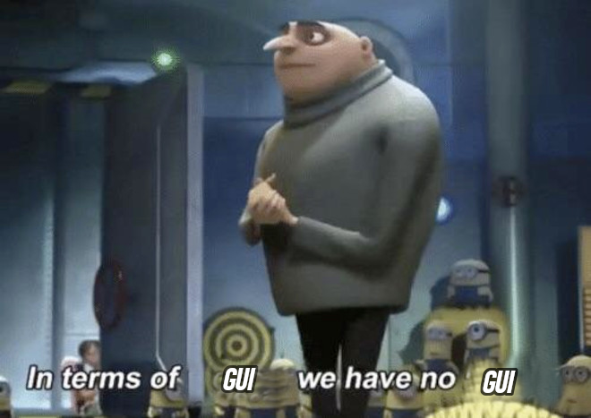

# Documentation

A project by *Finn Evers*, *Merlin Felix* and maybe *locutus* (No Comment)

| Java Version | IDE |
|--------------|-----|
| OpenJDK 18   | intelliJ IDEA, Visual Studio Code, genius.com |

Most documentation can be found in code with javadoc or normal comments. Please note this does not always apply.

The Utility-Package provides Operations for all usecases, its especially used for handly arrays. And arrays are mainly used to present some kind of game-field-map-map TM. 

## How to play this masterpiece

First of all, if u have a life and if u like it, dont.

But, in case u do not follow our wise advise, here is a guideline to play:

- The program should be executed in the top directory, so it can reach the `resources` folder. Otherwise it wont work correctly.
- Move the player by using the arrow-keys or `WASD`.
- Press enter of click anywhere on the gamefield to change the difficulty.
  Difficulty and the current level can be found on the bottom-left corner.
- Restart the game by pressing `R` on ur keyboard as if u were a pirate.
- Everybody knows Minecraft so u will know what to do and what not to do.
- Also there are two static properties in utility.Utility called `DEBUG` and `DEBUG_GRAPHICS` that conceptually doesn't belong there but let u toggle all debug prints. Functionality comes at the cost of bad design.

## What features did we implement?

- **static-map-lighting** and **dynamic-player-location-based-lighting**
- `WASD` keys for all u progamers out there.
- Creepers.
- **Dynamic map terrain**: Creepers can blow up pieces of the map.
- We did not implement one but ***TWO*** map generators.
- In **HARD-mode**, the **BigBrainBot** makes sure all enemies will reach u in the shortest way possible. For those who dont know, this is called a path finding algorithm.
- **Textures**.
- **Animations**. Yes, textures can be animated. I know this is quite an advanced concept that most modern AAA games don't even have, but we have it.
- ***Oscar-nominated*** sound-design.
- With our game, u can **Benchmark** ur PC, since we implemented all visual features in the most inefficient way we could think of.

## Our GUI-philosophy

